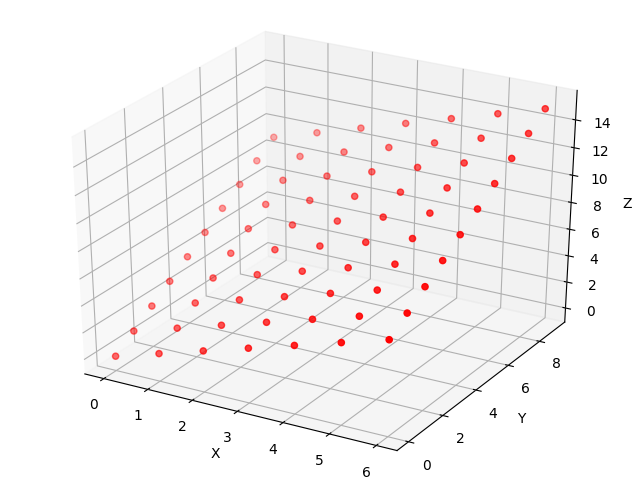

# matplotlib practice
## introduction
* Here are some common matplotlib example, i use this repo. to record some useful example about matplotlib api.

## 3D
### scatter diagram

```shell=
$ python scatter_3d.py
```

 
